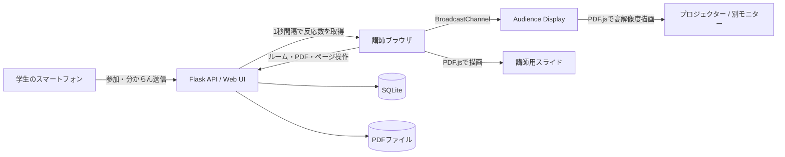

# Checkit

> 教室の「声にならない声」を、講師へ届けるリアルタイム学習支援アプリ

**チーム 507 容量不足 — Hackit 2026 Team 15**

Checkitは、学生が授業中に感じた「分からん」をスマートフォンから匿名で送信し、講師がその反応をスライド上と講義別の統計で確認できるWebアプリケーションです。

講師はPDFを使ってプレゼンテーションを行いながら、反応に応じて表示される🤔やスライド破壊演出を通じて、教室全体のつまずきを直感的に把握できます。

## 背景・課題

大人数の講義では、学生が分からない箇所をその場で質問しづらく、講師も一人ひとりの理解度を把握できません。その結果、疑問を残したまま授業が進み、学生が置いていかれてしまうことがあります。

Checkitは、この「分からないけれど声に出せない」という状況を次の流れで解決します。

1. 講師がルームを作成し、参加用URLまたはQRコードを共有する
2. 学生がスマートフォンからルームへ参加する
3. 分からない瞬間に「分からん」ボタンを押す
4. 講師のプレゼン画面へ反応が表示される
5. 講師がその場で立ち止まり、補足説明を行う
6. 授業後に講義別・ページ別の反応数を振り返る

## デモ

| 項目 | URL |
| --- | --- |
| リポジトリ | [Hackit-2026/Team15](https://github.com/Hackit-2026/Team15) |
| 講師画面（ローカル起動後） | [http://127.0.0.1:5000/tutor/login](http://127.0.0.1:5000/tutor/login) |
| 学生画面 | 講師が作成したルームのURLまたはQRコードから参加 |
| 発表資料 | 未設定（提出前にURLを追記） |
| 公開デモ | 現在はローカルまたは同一LAN内で実行 |

## 主な機能

### 学生向け

- ログインせず匿名で「分からん」を送信
- アカウント登録・ログイン後の送信にも対応
- ボタンを押した時点のPDFページ番号を自動記録
- ログイン利用時、自分が押した箇所への復習メモを同じブラウザ内に保存
- スマートフォン向けのシンプルな参加画面

### 講師向け

- 講師アカウントの登録・ログイン
- ルームの作成、終了、担当講義の一覧表示
- 参加用URL・QRコードの表示とコピー
- ルーム別の反応総数、平均、最多講義の確認
- PDFページ別の「分からん」集計

### プレゼンテーション

- 最大50MBのPDFをアップロードしてブラウザ上で表示
- 前後移動、キーボード操作、全画面表示
- 別モニター向けのAudience Display
- Audience Displayへのページ・反応・演出の同期
- プレゼン中の参加用QRコードとURL表示
- 反応に合わせて画面下部から🤔を表示
- ヒビ・爆発・破片を使ったスライド破壊演出
- 演出の有効・無効と発動回数をブラウザ内に保存

スライド破壊は初期状態で無効です。有効にすると、現在のページで検知した「分からん」の押下回数が設定した閾値（2〜100回）に達したときに発動します。同じ参加者の複数回押下も回数に含まれます。

## システム構成



学生の反応はFlask APIへ保存され、講師画面が1秒間隔で集計結果を取得します。講師画面とAudience Display間では、同じブラウザ内の`BroadcastChannel`を使ってページ番号・反応・演出を同期します。

## 工夫した点・こだわった点

- **声を出さなくても伝えられるUI**: 参加から送信までの操作を減らし、匿名のワンタップでも授業へ反応できるようにしました。

- **反応とスライドページの紐付け**: 押下時点のページ番号を記録することで、「どの説明でつまずいたか」を授業後にも確認できます。

- **講師が気付きやすい段階的な演出**: 🤔、ヒビ、爆発という視覚表現によって、数字だけでは見落としやすい教室の反応を直感的に伝えます。強い演出は初期状態で無効にし、講師が選択できるようにしました。

- **発表者画面と投影画面の分離**: Audience Displayを別ウィンドウで開き、講師の操作UIを見せずに別モニターへスライドを投影できます。

- **日本語PDFと高解像度表示への対応**: PDF.jsのCMap、標準フォント、WASMをローカル配置し、日本語文字の欠落を抑えています。投影画面ではPDFを直接再描画し、大画面でも解像度を保ちます。

- **PC・スマートフォン双方を意識したUI**: 講師画面はPC操作を中心に、学生画面とルーム作成UIは縦画面でも使いやすいレスポンシブ設計にしています。

## 使用技術

| 分類 | 技術 |
| --- | --- |
| フロントエンド | HTML / CSS / JavaScript / TypeScript / Chart.js |
| UIビルド | Vite 7 / npm |
| PDF表示 | PDF.js（`pdfjs-dist`）/ Canvas API |
| 画面同期 | BroadcastChannel API / Fullscreen API |
| バックエンド | Python / Flask 3 / Jinja2 / Flask-SQLAlchemy |
| データベース | SQLite |
| PDF検証 | pypdf |
| QRコード | qrcode |
| テスト | Vitest / TypeScript Compiler |

AI機能は現在の実装には含まれていません。重要語抽出などへの活用を今後の候補としています。

## ディレクトリ構成

```text
Team15/
├── flask_app/
│   ├── app.py                         # Flaskアプリの起点
│   ├── controllers/                   # 画面・APIルート
│   ├── models.py                      # User / Room / Presentation / Reaction
│   ├── templates/                     # Flask/Jinja2画面
│   ├── static/                        # CSS、JavaScript、配布用bundle
│   └── storage/presentations/         # アップロードPDF（実行時生成・Git管理外）
├── frontend/presentation/             # TypeScriptのプレゼン機能
├── scripts/                           # PDF.js資産の準備スクリプト
├── docs/                              # バックエンド要件資料
├── package.json
└── requirements.txt
```

## セットアップ

### 必要環境

- Python 3.10以上（開発環境: 3.14）
- Node.js 22.13以上
- npm

### 1. リポジトリを取得

```bash
git clone https://github.com/Hackit-2026/Team15.git
cd Team15
```

### 2. Python環境を準備

macOS / Linux:

```bash
python3 -m venv venv
source venv/bin/activate
python -m pip install --upgrade pip
python -m pip install -r requirements.txt
python -m pip install pypdf==6.14.2
```

Windows PowerShellでは、仮想環境の有効化に次を使います。

```powershell
venv\Scripts\Activate.ps1
```

> `pypdf`はプレゼンテーションAPIの起動に必要ですが、現在の`requirements.txt`には含まれていないため個別にインストールします。

### 3. フロントエンド依存関係とPDF.js資産を準備

```bash
npm ci
npm run prepare:pdfjs
```

`prepare:pdfjs`は、日本語PDFの描画に必要なCMap、標準フォント、WASMを`flask_app/static/pdfjs/`へコピーします。このディレクトリはGit管理外のため、初回起動前に必ず実行してください。

### 4. Flaskを起動

```bash
cd flask_app
flask --app app run --debug
```

ブラウザで[http://127.0.0.1:5000/tutor/login](http://127.0.0.1:5000/tutor/login)を開き、最初の講師アカウントを作成してください。SQLiteのデータベースとテーブルは初回起動時に自動作成されます。

### 同一LANのスマートフォンから参加する

```bash
cd flask_app
flask --app app run --debug --host=0.0.0.0 --port=5000
```

1. PCとスマートフォンを同じネットワークへ接続する
2. PCのLAN内IPアドレスを確認する（例: `192.168.1.10`）
3. PCで`http://192.168.1.10:5000/tutor/login`を開く
4. ルームを作成し、表示されたQRコードをスマートフォンで読み取る

QRコードは、講師がアクセスしているホスト名を基に参加用URLを生成します。LAN実演時は講師画面も`127.0.0.1`ではなく、PCのLAN内IPアドレスで開いてください。接続できない場合はOSのファイアウォール設定も確認してください。

## 基本的な使い方

1. `/tutor/login`で講師アカウントを作成してログインする
2. 講師ホームからルームを作成する
3. 「参加者に共有」からURLまたはQRコードを学生へ共有する
4. 「プレゼンテーション」でPDFを選択する
5. 必要に応じて演出設定を変更する
6. 「別画面でプレゼン」でAudience Displayを開き、投影先モニターへ移動する
7. 学生が「分からん」を送信し、講師が反応を確認する
8. 講義終了後、講義一覧や詳細画面で反応数を振り返る

Audience Displayが開かない場合は、ブラウザのポップアップを許可してください。

## 主な画面・エンドポイント

| パス | 用途 |
| --- | --- |
| `/tutor/login` | 講師のログイン・アカウント作成 |
| `/tutor/` | 講師ダッシュボード・ルーム作成 |
| `/tutor/rooms` | 担当講義と反応統計 |
| `/tutor/room/<room_id>` | ルーム管理 |
| `/tutor/room/<room_id>/presentation` | PDFプレゼンテーション |
| `/room/<room_id>` | 学生の参加画面 |
| `/api/reaction/<room_id>` | 「分からん」の送信（POST） |
| `/api/room/<room_id>/result` | ルーム・ページ別集計（GET） |

プレゼンテーションAPIの設計とバックエンド要件は、[docs/presentation-backend-requirements.md](docs/presentation-backend-requirements.md)を参照してください。

## 開発・検証

```bash
# TypeScriptの型チェック
npm run typecheck

# フロントエンドの単体テスト
npm test

# PDF.js資産を再生成
npm run prepare:pdfjs

# Audience DisplayのTypeScriptを変更した場合
npm run build:projection
```

現在は講師用プレゼンのTypeScriptソースと配布済み`presentation.js`の統合が作業途中です。通常のセットアップではGitに含まれる配布済みbundleを使用し、`npm run build`で上書きしないでください。Python側の自動テストはまだありません。

## データの保存場所

| データ | 保存先 |
| --- | --- |
| ユーザー、ルーム、プレゼン状態、反応 | `flask_app/data.sqlite` |
| アップロードしたPDF | `flask_app/storage/presentations/` |
| ログイン学生の復習メモ・ローカル履歴 | 学生端末の`localStorage` |
| 講師の演出設定 | 講師端末の`localStorage` |

DB、アップロードPDF、生成したPDF.js資産はGitへコミットされません。復習メモと演出設定はサーバー同期されないため、別の端末やブラウザには引き継がれません。

## 現在の制限

- リアクション表示はWebSocketではなく1秒間隔のポーリング
- Audience Displayとの同期は、同じブラウザ・同じオリジンの`BroadcastChannel`に依存
- 匿名参加者の履歴はサーバーへ保存せず、ログイン時のメモもブラウザ内のみ
- 爆発の閾値はユニーク人数ではなく押下回数
- PDFは50MB以下、暗号化されていないファイルのみ対応
- SQLite、固定の開発用シークレットキー、Flask開発サーバーを使うため本番運用には未対応

## 今後の展望

- WebSocketによる低遅延な双方向同期
- 講義と各回のルームを分けた授業管理
- ユーザー単位の復習履歴・メモのサーバー同期
- 同一ユーザーの連打を考慮したユニーク参加者集計
- AIによるスライドの重要語抽出と復習支援
- PostgreSQL、環境変数、WSGIサーバーを使った本番運用構成
- 実際の大学講義での実証実験とフィードバック反映

## メンバー

| 名前 | 担当 |
| --- | --- |
| 森下 陽 | フロントエンド |
| 溝口 泰輝 | フロントエンド |
| 長谷川 雄大 | バックエンド |
| 谷越 史葵 | バックエンド |
